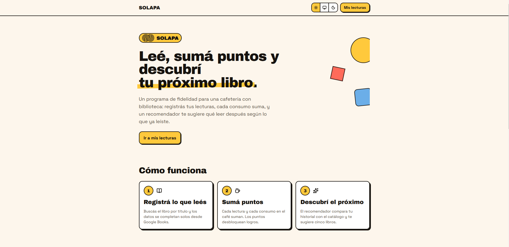
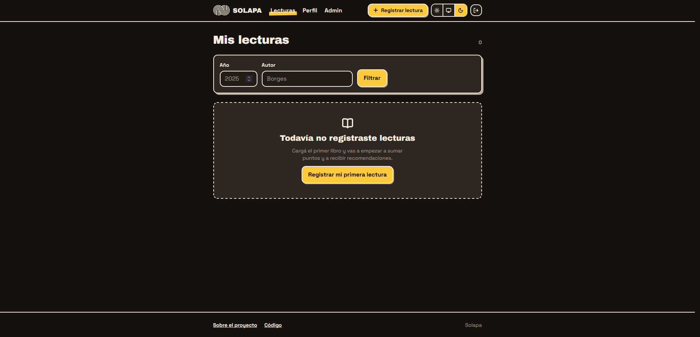
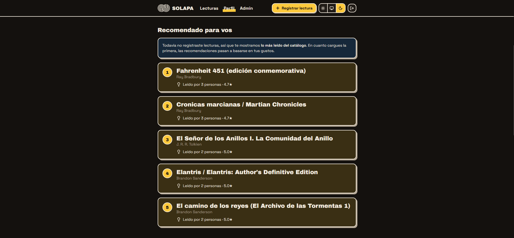
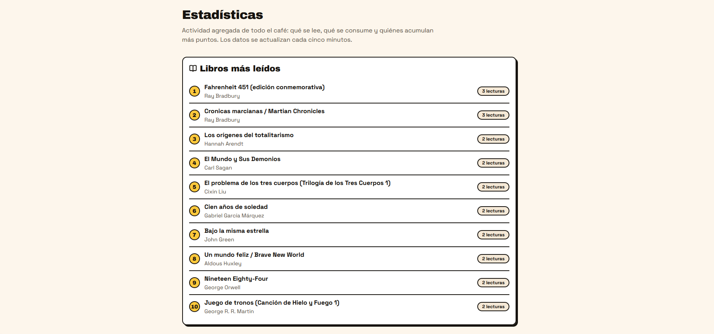

# SOLAPA

Aplicación web para una cafetería que funciona también como biblioteca. Cada usuario tiene un
perfil donde registra sus lecturas, acumula puntos por consumo y lectura, desbloquea logros con
recompensas, y recibe **recomendaciones de libros personalizadas** generadas con embeddings
semánticos.

🔗 **[Ver la demo](https://cafe-r71e.onrender.com)** · usuario `ana@demo.com`, contraseña `demo1234`

> Proyecto de portfolio desarrollado en solitario, organizado en 7 sprints.
| | |
|---|---|
|  |  |
|  |  |

| | |
|---|---|
|  |  |
|  |  |

---

## Stack

| Capa | Tecnología |
|---|---|
| Framework | Next.js 16 (App Router), React 19, TypeScript |
| Estilos | Tailwind CSS 4 con sistema de tokens propio |
| Iconos | lucide-react |
| Base de datos | Neon (Postgres serverless) + extensión `pgvector` |
| ORM | Prisma 7 con driver adapter de Neon |
| Autenticación | Auth.js v5 — Credentials + sesión JWT, passwords con bcrypt |
| Embeddings | `paraphrase-multilingual-MiniLM-L12-v2` (384 dimensiones) |
| Deploy | Render |

---

## Funcionalidades

- **Autenticación** con email y contraseña, sesión JWT y roles (`USER` / `ADMIN`)
- **Registro de lecturas** con buscador contra la API de Google Books, y modelo de libro
  reutilizable que evita duplicados entre usuarios
- **Compras simuladas** cargadas desde un panel de administración
- **Sistema de puntos y logros** que se desbloquean automáticamente al cumplir condiciones
- **Recomendador de lecturas** por similitud semántica *(ver más abajo)*
- **Perfil** con historial de compras, puntos, progreso de logros y recomendaciones
- **Estadísticas públicas** con los libros más leídos, los productos más comprados y los
  lectores con más puntos, cacheadas cada 5 minutos
- **Interfaz con sistema de diseño propio**, modo claro/oscuro y contraste verificado
  *(ver más abajo)*

---

## El recomendador

La pieza central del proyecto. No usa un LLM con prompt: funciona por **similitud semántica**
entre representaciones vectoriales de los libros.

### Cómo funciona

1. Cada libro se representa con un embedding de 384 dimensiones generado a partir de su
   **título, autor, género y sinopsis**.
2. Al pedir recomendaciones, los vectores se **centran** restando el centroide del catálogo.
3. Cada candidato se puntúa por su **máxima similitud coseno contra cualquier libro del
   historial del usuario**, ponderada por la valoración que le dio a ese libro.
4. Se descartan los ya leídos y las ediciones casi idénticas.
5. Se devuelven 5, cada uno acompañado del libro que justificó la recomendación.

Un usuario sin historial recibe un **fallback por popularidad**: los libros más leídos del
catálogo, desempatados por la valoración promedio de quienes los leyeron.

### Evaluación

El recomendador se evalúa con un harness propio (`scripts/evaluate-recommender.ts`) que hace
**leave-one-out**: oculta una lectura del historial, pide recomendaciones con el resto, y
verifica si el libro oculto aparece entre los 5 sugeridos.

Métricas reportadas:

- **recall@5** — con qué frecuencia el libro oculto entra en el top-5
- **MRR@5** — qué tan arriba aparece dentro de esa lista
- **percentil promedio** — su posición en el ranking completo, normalizada *(comparable entre
  catálogos de distinto tamaño)*
- **lift** — cuántas veces mejor que el azar
- **diversidad intra-lista** — para vigilar que optimizar precisión no vuelva las
  recomendaciones repetitivas

```
Catálogo de 53 libros · 9 usuarios · 54 evaluaciones

recall@5    0.5556      (azar: 0.096  →  lift 5.78x)
MRR@5       0.3725
percentil   0.1847      (0 = perfecto, 0.5 = azar)
diversidad  0.6872
```

El libro oculto entra en el top-5 en el **56% de los casos** y queda, en promedio, dentro del
**primer quinto** del ranking.

Las lecturas ocultas con valoración ≤ 2 se **excluyen** de la evaluación: pedirle al sistema que
prediga un libro que al usuario le disgustó es medir al revés. Al aplicar el filtro el numerador
no cambió (26 aciertos sobre 59 y sobre 52), lo que confirma que esas 7 eran todas fallos.

### El recorrido: qué se probó y qué se midió

Cada mejora se midió contra el baseline anterior antes de adoptarse.

| Cambio | recall@5 | MRR@5 | percentil |
|---|---|---|---|
| Baseline inicial | 0.2373 | 0.1093 | 0.3334 |
| Sinopsis de Wikipedia en vez de Google Books | 0.3390 | 0.2531 | 0.2449 |
| Centrado de embeddings (corrección de *hubness*) | 0.4746 | 0.2938 | 0.1780 |
| Sección "Argumento" en vez de la introducción | 0.5424 | 0.3684 | 0.1874 |
| *— cambio de datos: valoraciones realistas y métrica corregida —* | | | |
| Punto de partida del nuevo tramo | 0.5000 | 0.3481 | 0.2134 |
| Ponderación por valoración del usuario | 0.5385 | 0.3974 | 0.1923 |
| **Configuración final** (53 libros, fp32 vía API) | **0.5556** | **0.3725** | **0.1847** |

Los tramos separados por esa línea **no son comparables entre sí**: cambió el conjunto de
lecturas y la definición de la métrica. Dentro de cada tramo sí lo son.

**Hallazgos que explican cada salto:**

- **La longitud del texto dominaba el espacio vectorial.** Las sinopsis de Google Books son
  contratapas de marketing de largo muy variable; el eje dominante del espacio terminó siendo
  *"cuánto texto había"* en lugar de *"de qué trata el libro"*. *Harry Potter* quedaba lejos de
  *El Hobbit*, y este último cerca de una novela juvenil sin relación temática.

- **Hubness.** Unas pocas novelas ocupaban el centro denso del espacio (similitud media contra
  el catálogo de 0.412, frente a 0.170 en los extremos) y aparecían recomendadas a casi todos
  los usuarios sin importar sus gustos. Las novelas comparten vocabulario narrativo; los ensayos
  quedan en la periferia. Restar el centroide del corpus lo corrigió: un usuario que lee ensayos
  pasó de acertar 0 de 7 a 7 de 7.

- **La introducción de Wikipedia es metadato, no contenido.** Los primeros 400 caracteres del
  artículo de *Juego de tronos* —todo lo que entra en la ventana de contexto del modelo— eran
  título en inglés, transcripción fonética, año, premio y posición en la serie. De la trama,
  nada. Extraer la sección "Argumento"/"Sinopsis" resolvió el problema.

- **Las valoraciones no influían en nada.** Se guardaban y se mostraban, pero el peso solo
  alimentaba una rama del código que no era la de producción. Eran dato muerto para el
  recomendador.

### Un resultado negativo

Se intentó filtrar el "relleno" de las sinopsis (elogios de editorial, citas de prensa)
comparando oraciones entre libros: lo que se repite en muchos libros es marketing, lo único de
cada uno es contenido. **Fracasó dos veces, y el porqué resultó más interesante que la idea:**

1. **Filtrado por umbral de similitud.** Detectaba correctamente el marketing genérico, pero no
   movió las métricas. Al medir la posición de cada oración filtrada dentro del texto, 6 de 7
   caían más allá del carácter 400 — o sea, el truncado del modelo **ya las descartaba**. El
   filtro estaba limpiando texto que el modelo nunca veía.

2. **Selección por "distintividad".** Empeoró de forma clara (recall 0.36 → 0.18). La
   distintividad premia nombres propios y metadatos de edición —traductores, prologuistas,
   promociones de series de TV— porque son únicos en el corpus, mientras que los resúmenes de
   trama comparten registro narrativo y puntúan como genéricos. La métrica proxy resultó
   **anti-correlacionada** con el objetivo real.

El experimento se revirtió. Queda documentado porque descartar una hipótesis con evidencia es
parte del trabajo.

---

## Interfaz

El lenguaje visual es **neobrutalista**: bordes negros de 2 px, sombras duras sin desenfoque,
color plano y tipografía pesada. Los elementos interactivos responden con física — los botones
se hunden hacia su sombra al presionarlos, las tarjetas se levantan al pasarles el cursor.

### Tokens y temas

Los colores se definen una sola vez con `light-dark()`, que resuelve según la propiedad
`color-scheme` del documento:

```css
--ink:        light-dark(#16130F, #F5EDE0);
--ink-shadow: light-dark(#16130F, #B5A896);
```

Esto evita duplicar la paleta bajo un `@media (prefers-color-scheme)`, y reduce el selector de
tema manual a cambiar `color-scheme` en la raíz. Como efecto secundario, los controles nativos
—`select`, selector de fecha, barras de desplazamiento— siguen el tema sin una línea de CSS, lo
que importa en una aplicación tan cargada de formularios.

En modo oscuro la sombra **no** usa el mismo color que el borde: las formas claras sobre fondo
oscuro se perciben más grandes, y una sombra crema a plena luminosidad se comía la composición.
Va un tono más apagado, para que el ojo lea contorno y desplazamiento como dos capas.

### El contraste se midió, no se estimó

Antes de adoptar la paleta se calculó el ratio WCAG de cada par. Dos colores que parecían
utilizables no lo eran:

| Par | Ratio | |
|---|---|---|
| `--coral` sobre papel claro | 2.61 | ✗ |
| `--leaf` sobre papel claro | 3.21 | ✗ |
| `--danger-text` sobre papel claro | 6.59 | ✓ AA |
| `--success-text` sobre papel claro | 5.52 | ✓ AA |

De ahí una regla del sistema: **los acentos van de fondo con tinta oscura encima, nunca como
color de texto**. Los mensajes de estado usan tokens propios.

### Accesibilidad

- `TextField` cablea `aria-invalid` y `aria-describedby` por su cuenta, de modo que un campo en
  error no puede quedar sin anunciar por olvido.
- Los errores se marcan con **borde, fondo y texto** — el color no es el único portador de la
  información.
- `role="alert"` para lo que bloquea, `role="status"` para lo que informa.
- Anillo de foco visible con `:focus-visible`, barras de progreso con `aria-valuenow`, y respeto
  por `prefers-reduced-motion`.
- Borrar una lectura pide confirmación en línea, nombrando el libro: es irreversible.

### Estados

Cada ruta tiene esqueletos de carga con la forma del contenido final (para que no salte el
layout), pantallas de error con reintento real, y 404 propios. El reintento importa acá en
concreto: Neon suspende el compute por inactividad, y `error.tsx` usa la prop `retry` de
Next 16 —que vuelve a pedir los datos— en lugar de `reset`, que solo re-renderiza.

---

## Estructura del proyecto

```
app/
  (public)/                           landing y estadísticas — sin sesión
    page.tsx                          portada
    stats/                            rankings agregados
  (auth)/login · (auth)/register      formularios de autenticación
  (user)/                             requiere sesión (ver proxy.ts)
    profile/                          perfil, logros, compras y recomendaciones
    readings/                         listado con filtros por año y autor
    readings/new · readings/[id]/edit alta y edición
    admin/                            panel de carga de compras (solo ADMIN)
  api/                                endpoints HTTP
  error.tsx · not-found.tsx           estados globales
  icon.svg · opengraph-image.tsx      metadata generada

components/
  ui/                                 sistema de diseño (Card, Button, Field, Badge…)
  layout/                             navegación, selector de tema, logo
  auth/ · profile/ · reading/         componentes por dominio

lib/
  prisma.ts                           cliente singleton + reintentos de conexión
  points.ts                           reglas de conversión a puntos
  achievements.ts                     evaluación y desbloqueo de logros
  recommendations.ts                  lógica del recomendador
  embeddings.ts                       generación de vectores (local o vía API)
  stats.ts                            consultas agregadas de /stats
  wikipedia.ts · google-books.ts      fuentes de metadatos
  actions/                            Server Actions

prisma/                               schema, migraciones y seed
scripts/                              harness de evaluación y utilidades
types/                                ampliación de tipos de Auth.js
```

**Server Actions vs Route Handlers:** se usa un Route Handler cuando hace falta una URL
direccionable desde afuera (endpoint de recomendaciones, handlers de Auth.js, proxy de Google
Books), y una Server Action cuando es una mutación pegada a la propia interfaz sin consumidores
externos (borrar una lectura, cargar una compra). Cada Server Action verifica permisos por su
cuenta: es un endpoint en sí misma y no hereda la protección de la página que la invoca.

**Route groups:** los paréntesis agrupan rutas sin afectar la URL. `(public)` y `(user)` tienen
layouts distintos —uno con cabecera de sitio, otro con navegación de aplicación— pero
`(user)/admin` sigue respondiendo en `/admin`.

**Qué va dentro de una transacción:** lo que comparte un invariante va adentro (crear una lectura
y sus puntos: una sin la otra es estado corrupto); lo derivado y recomputable va afuera
(`checkAndUnlockAchievements`, que recalcula desde cero y es idempotente). No es una preferencia
estética: con la evaluación de logros adentro, la transacción hacía ~8 viajes secuenciales a la
base y superaba el timeout de 5 s de Prisma en producción.

---

## Correrlo localmente

### 1. Dependencias

```bash
npm install
```

### 2. Base de datos

Crear un proyecto en [Neon](https://neon.tech) y habilitar `pgvector`:

```sql
CREATE EXTENSION IF NOT EXISTS vector;
```

### 3. Variables de entorno

Copiar `.env.example` a `.env.local` y completar:

```bash
DATABASE_URL="postgresql://..."           # conexión pooled de Neon
DATABASE_URL_UNPOOLED="postgresql://..."  # conexión directa, para migraciones
AUTH_SECRET=""                            # generar con: npx auth secret
AUTH_TRUST_HOST=true                      # obligatoria detrás de un proxy (Render)
GOOGLE_BOOKS_API_KEY=""                   # console.cloud.google.com → habilitar "Books API"
HUGGINGFACE_API_KEY=""                    # opcional: sin esta variable usa el modelo local
NEXT_PUBLIC_SITE_URL=""                   # URL pública; sin ella las tarjetas de compartir
                                          # apuntan a localhost
```

Las variables van en `.env.local` (convención de Next). `prisma.config.ts` las carga
explícitamente con `dotenv` apuntando a ese archivo.

### 4. Migraciones y datos de ejemplo

```bash
npx prisma migrate dev
npx prisma generate
npx prisma db seed
```

El seed es **idempotente**: puede correrse las veces que haga falta sin duplicar datos. Crea el
catálogo de libros, 8 usuarios de ejemplo con historiales de lectura coherentes, compras
distribuidas en el tiempo, y genera los embeddings faltantes.

Usuarios de ejemplo: `ana@demo.com` … `hugo@demo.com`, contraseña `demo1234`.

### 5. Arrancar

```bash
npm run dev
```

### Comandos útiles

```bash
npx prisma studio                              # inspeccionar la base de datos
npx tsx scripts/rebuild-embeddings.ts          # regenerar todos los embeddings
npx tsx scripts/evaluate-recommender.ts        # correr el harness de evaluación
npx tsc --noEmit && npm run lint               # verificación
```

El harness sin argumentos mide **la configuración real de producción**. Acepta overrides para
comparar variantes: `npx tsx scripts/evaluate-recommender.ts centroid uncentered`.

---

## Deploy

Desplegado en **Render**, tier gratuito:

| Campo | Valor |
|---|---|
| Build Command | `npm install && npm run build` |
| Start Command | `npm start` |

`package.json` incluye `"postinstall": "prisma generate"`, imprescindible: `app/generated/` está
en `.gitignore` y sin el cliente el build falla.

Variables en el panel de Render: `DATABASE_URL`, `AUTH_SECRET` (distinto al de desarrollo),
`AUTH_TRUST_HOST=true`, `GOOGLE_BOOKS_API_KEY`, `HUGGINGFACE_API_KEY` y `NEXT_PUBLIC_SITE_URL`.

`AUTH_TRUST_HOST=true` no es opcional: Auth.js confía en el host automáticamente solo en Vercel
y Netlify. Sin esa variable la aplicación levanta bien pero **el login falla con
`UntrustedHost`**, un síntoma difícil de asociar con la causa.

---

## Decisiones de alcance

**El sistema de negocio real está simulado.** La versión original del spec incluía punto de
venta, facturación fiscal, integración con medios de pago y una terminal física en el local.
Todo eso quedó explícitamente fuera: implementarlo es un proyecto en sí mismo y no aporta al
foco, que es la plataforma de usuarios. Las compras se cargan desde un panel de administración
y con datos semilla, lo que da un historial de consumo realista para alimentar puntos, logros y
estadísticas sin resolver pagos reales.

**El catálogo está congelado por ISBN.** Los libros semilla se identifican por ISBN fijo y no
por búsqueda de texto libre. El motivo es metodológico: el ranking de Google Books no es
determinístico, y sin un catálogo estable las métricas del recomendador no serían comparables
entre corridas.

**La inferencia corre fuera del servidor en producción.** El paquete de transformers pesa
~497 MB y no entra en la memoria del contenedor de despliegue. Se usa la Inference API de
HuggingFace **con el mismo modelo**, de modo que los vectores siguen siendo compatibles y las
mediciones conservan validez (coseno 0.9967 entre local y API; la diferencia venía de la
cuantización). En desarrollo, sin `HUGGINGFACE_API_KEY`, el modelo corre local.

**El catálogo no se agrandó más allá de ~50 libros.** Se evaluó llevarlo a 150-200 usando
categorías de Wikipedia, y se descartó: bajaría el `recall@5` por el aumento de distractores sin
aportar metodología, y los volcados de categorías sesgan hacia libros oscuros con artículos
mínimos, que degradarían la calidad de las representaciones.

**Se descartaron dos fuentes de datos después de verificarlas.** Open Library: 4 de 6 ISBNs
españoles dan 404, y buscar por título en español cae en registros vacíos, con lo que solo el
27% del catálogo obtenía datos útiles. El `averageRating` de Google Books: cobertura 5 de 8 y
conteos de 1 a 9 votos (*Cien años de soledad* puntúa 3/5 con 2 votos). Ruido muestral, no señal.

---

## Limitaciones conocidas

- **Los usuarios de ejemplo son sintéticos**, con gustos más coherentes que los de un lector
  real. Las métricas del recomendador son, por lo tanto, probablemente **optimistas**. El único
  perfil "desordenado" del conjunto es consistentemente el que peor rinde.
- El **motivo** de cada recomendación es el libro más similar del historial, no una explicación
  generada. Puede resultar poco intuitivo en algunos casos.
- El **catálogo es colaborativo y sin moderación**: cualquier usuario registrado puede agregar
  libros, y esos libros afectan las recomendaciones de todos.
- Los **rankings de `/stats` son públicos y muestran nombres de usuario**. Se usa `name` con
  fallback a "Lector anónimo" y nunca el email, pero en un producto real aparecer en el ranking
  debería ser opcional y consentido.
- **Desarrollo y producción comparten la misma base de datos.** Lo correcto sería un branch de
  Neon para separarlas.
- La demo corre en tiers gratuitos que **suspenden por inactividad**. La primera visita después
  de un rato puede tardar hasta un minuto, y ocasionalmente fallar una vez antes de responder.
  No es un problema de la aplicación sino del entorno de despliegue.
- El fallback de sinopsis para libros sin artículo de Wikipedia usa los datos de Google Books,
  de menor calidad para este uso.

---

## Estado

| Sprint | |
|---|---|
| 0 — Setup y modelo de datos | ✅ |
| 1 — Autenticación y perfiles | ✅ |
| 2 — Registro de lecturas | ✅ |
| 3 — Compras simuladas | ✅ |
| 4 — Puntos y logros | ✅ |
| 5 — Recomendador de lecturas | ✅ |
| 6 — Estadísticas, pulido y deploy | ✅ |
